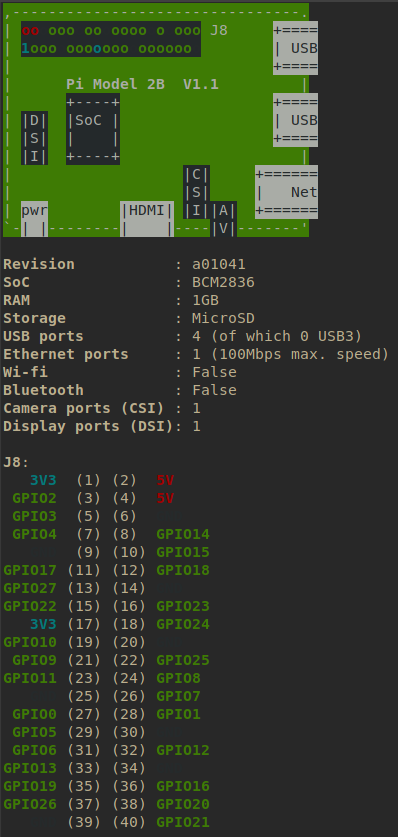

# rpi-python_GPIO
Some script to play with python and GPIO pins

You can use "pinout" command in your rpi for showing pin and GPIO number associations, this is the command output :



Each number associations on py codes is related GPIO number for example :
```
# Setting up color/pin association
B = 17
R = 18
Y = 27
G = 22
```
Blue led is linked in GPIO17 pin number  (11)<br>
Red led is linked in GPIO18 pin number   (12)<br>
Yellow ed is linked in GPIO27 pin number (13)<br>
Green ed is linked in GPIO22 pin number  (15)<br>

